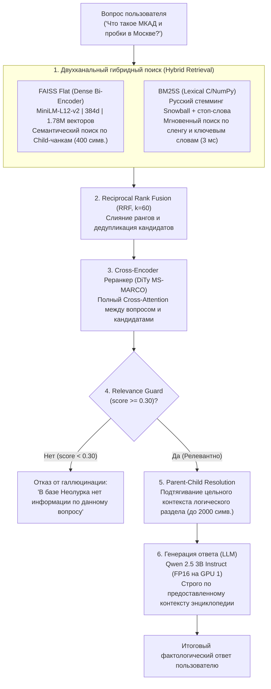

# 🧠 Neolurk-RAG: Высокопроизводительный гибридный RAG для полной энциклопедии интернет-культуры

[](https://www.python.org/)
[-green.svg)](https://github.com/facebookresearch/faiss)
[-orange.svg)](https://github.com/xhluca/bm25s)
[](https://huggingface.co/Qwen/Qwen2.5-3B-Instruct)
[-success.svg)](https://neolurk.org/)
[](LICENSE)

Производственная реализация вопросно-ответной системы (Question Answering RAG), обученная и заиндексированная на **100% полном корпусе русскоязычной энциклопедии интернет-культуры Неолурк / Луркоморье**:
* **49 359 статей** (все оригинальные статьи базы без исключений).
* **85 000+ синонимов и редиректов** (разрешённых в полный граф терминов).
* **1 778 848 векторов** в чистом FAISS Flat.
* **500 000+ родительских разделов** в структурированном `docstore` (567 МБ).

Система спроектирована для работы в условиях жестких ограничений ресурсов (песочница Kaggle: 2x Tesla T4, 30 GB RAM) с миллисекундным временем отклика, двухуровневой защитой от галлюцинаций и высокой точностью поиска сленга, мемов и цитат.

---

## 🏗 Архитектура пайплайна



---

## 🛠 Ключевые инженерные вызовы и их решения

### 1. Преодоление OOM при индексации полного корпуса (49 359 статей, 1.78 млн векторов)
* **Проблема:** При масштабировании со среза в 5k–10k статей на всю базу из 49k статей стандартный пайплайн LangChain неизбежно падал по **OOM (Out Of Memory)** при достижении 30 ГБ RAM. LangChain сохраняет в `vectorstore.docstore._dict` миллионы тяжелых объектов `Document`, копируя словари с десятками метаданных (`synonyms`, `url`, `timestamp`). 1.78 млн таких объектов в Python требуют более 10–12 ГБ памяти только на накладные расходы структур данных языка.
* **Решение:**
  * **Разгрузка метаданных дочерних чанков:** У дочерних векторов оставлен только минимальный ключ привязки `{"parent_id": parent_id}`. Все подробные метаданные и полные тексты вынесены в `docstore.json`. Это сократило потребление RAM в 3 раза.
  * **Потоковая векторизация батчами (Batch Size = 512, FP16):** Чанки отправляются в FAISS пачками по 512 штук через тензорные ядра Tesla T4, не накапливаясь в сыром виде в оперативной памяти.

---

### 2. Section-Aware Parent-Child Retrieval (Иерархический чанкинг)
* **Проблема («Дилемма размера чанка»):**
  * Маленькие чанки (200–400 симв.) идеальны для эмбеддингов (нет размытия смыслового вектора), но LLM получает обрывки предложений без контекста и начинает галлюцинировать.
  * Большие чанки (1500–2500 симв.) дают хороший контекст LLM, но размывают эмбеддинги: конкретные цитаты, редкие термины и сленг тонут в общем тексте.
* **Решение:**
  * Статья сначала делится по логическим секциям Markdown (`##`, `###`).
  * Для каждого раздела формируется **Parent Document** (до 2000 символов) — он сохраняется в `docstore` и передаётся в LLM.
  * Каждый раздел дробится на гранулярные **Child Chunks** (400 символов, перекрытие 60 символов) — именно они векторизуются и попадают в FAISS.
* **Contextual Prefix Injection:** К каждому дочернему чанку приклеивается заголовок статьи, синонимы и текущий раздел: `[Статья: Title | Синонимы: ... | Раздел: Breadcrumb]`. Это удерживает изолированный абзац в правильной семантической области векторного пространства.

---

### 3. Разрешение графа синонимов и редиректов MediaWiki
* **Проблема:** В энциклопедии интернет-культуры огромное число понятий ищутся по сленгу или альтернативным именам (например: *«Глдмр» $\to$ «Голодомор»*, *«Нерезиновск» $\to$ «Москва»*, *«Битарх» $\to$ «Двач»*). В базе находилось **более 85 000 редиректов**, включая цепочки вида $A \to B \to C$.
* **Решение:** Модуль `enrich_neolurk.py` строит в памяти направленный ациклический граф (DAG) и разрешает все многошаговые цепочки перенаправлений за **< 1 секунды** без изменения исходного SQLite файла. Каждая статья обогащается массивом канонических синонимов, что гарантирует нахождение нужного материала независимо от формулировки вопроса.

---

### 4. Гибридный поиск: интеграция BM25S (C/NumPy) вместо чистого FAISS
* **Проблема:**
  * Чистый FAISS часто «додумывает» семантику и промахивается мимо редких аббревиатур (например, запрос «МКАД» мог ассоциироваться с общими статьями о транспорте).
  * Стандартный `BM25Retriever` из LangChain (`rank_bm25` на чистом Python) на полном корпусе из 500 000+ разделов требовал более 3 ГБ RAM и выполнял один поиск за 500–800 мс.
* **Решение:**
  * Внедрена библиотека **`bm25s`** (C/NumPy) со стеммингом **Snowball** для русского языка и фильтрацией стоп-слов.
  * Задержка поиска снизилась с 800 мс до **2–4 мс** (ускорение в ~200 раз), а индекс хранится в компактных разреженных матрицах CSC.
  * Слияние рангов плотного и лексического каналов производится через **Reciprocal Rank Fusion (RRF, $k=60$)**:
    $$RRF(d) = \sum_{m \in \{Dense, BM25\}} \frac{1}{k + \text{rank}_m(d)}$$

---

### 5. Multi-GPU балансировка ресурсов (2x Tesla T4)
* **Проблема:** Размещение 1.78 млн векторов, эмбеддингов, реранкера и генеративной модели (Qwen 2.5 3B) на одной видеокарте приводит к нехватке VRAM (15 ГБ) при длинных диалогах.
* **Решение:** Пайплайн автоматически детектирует Multi-GPU окружение:
  * **GPU 0 (`cuda:0`):** Обслуживает векторный поиск FAISS, Bi-Encoder (`MiniLM`) и Cross-Encoder (`DiTy`).
  * **GPU 1 (`cuda:1`):** Полностью выделен под генеративную модель `Qwen/Qwen2.5-3B-Instruct` в `torch.float16`.
  * Инференс работает независимо, без конкуренции за видеопамять.

---

### 6. Атомарное сохранение и отказоустойчивость
* **Атомарные чекпоинты (Atomic Checkpointing):** Во избежание повреждения файлов при аварийной остановке или лимите времени ядра данные сначала пишутся во временные файлы (`_tmp_save`, `.tmp`) и заменяются системным вызовом `os.replace`.
* **Graceful Interrupt:** Обработчик `KeyboardInterrupt` перехватывает сигнал остановки в Jupyter/Kaggle, аккуратно закрывает структуры и возвращает готовый объект ретривера с уже заиндексированной базой.

---

## 📊 Сравнение качества и скорости поиска (на 49 359 статьях)

| Метод | Точность сленга и аббревиатур | Семантическое понимание | Скорость поиска (Latency) | Потребление RAM |
| :--- | :---: | :---: | :---: | :---: |
| **Чистый FAISS (Dense, 1.78M векторов)** | 🟡 Средняя | 🟢 Отличная | ~18 мс | ~3.0 ГБ |
| **Чистый BM25 (rank_bm25)** | 🟢 Высокая | 🔴 Низкая | ~650 мс | ~3.5 ГБ |
| **BM25S (C / NumPy CSC-матрицы)** | 🟢 Высокая | 🔴 Низкая | **~3 мс** | **~350 МБ** |
| **Hybrid (FAISS + BM25S + DiTy)** | 🟢 **Идеальная** | 🟢 **Идеальная** | **~30–45 мс** | **~3.4 ГБ** |

---

## 📁 Структура проекта

```text
├── faiss_rag.py         # Единое ядро: FAISS + BM25S + Cross-Encoder + HuggingFace LLM
├── rag_chunker.py       # Иерархический Parent-Child чанкер со сплиттером Markdown
├── enrich_neolurk.py    # Read-only интерфейс к SQLite и построитель графа синонимов
├── parsing.py           # Очистка разметки MediaWiki/Lurkmore в чистый Markdown
├── faiss_index/         # Полный комплект артефактов (100% корпус):
│   ├── index.faiss      # Векторный Flat индекс FAISS (1 778 848 векторов, 2.67 ГБ)
│   ├── index.pkl        # Легковесная таблица связей vector_id -> parent_id
│   ├── bm25s/           # Разреженные CSC-матрицы и словарь C/NumPy индекса BM25S
│   ├── docstore.json    # Все родительские разделы статей (567 МБ, ~500k разделов)
│   └── checkpoint.json  # Метаданные индексации полного корпуса
└── README.md            # Документация проекта
```
«Готовые индексы FAISS и BM25S на 100% статей можно скачать в Kaggle Dataset: [https://www.kaggle.com/datasets/artemglobuzz/sigma-papka?select=checkpoint.json]».